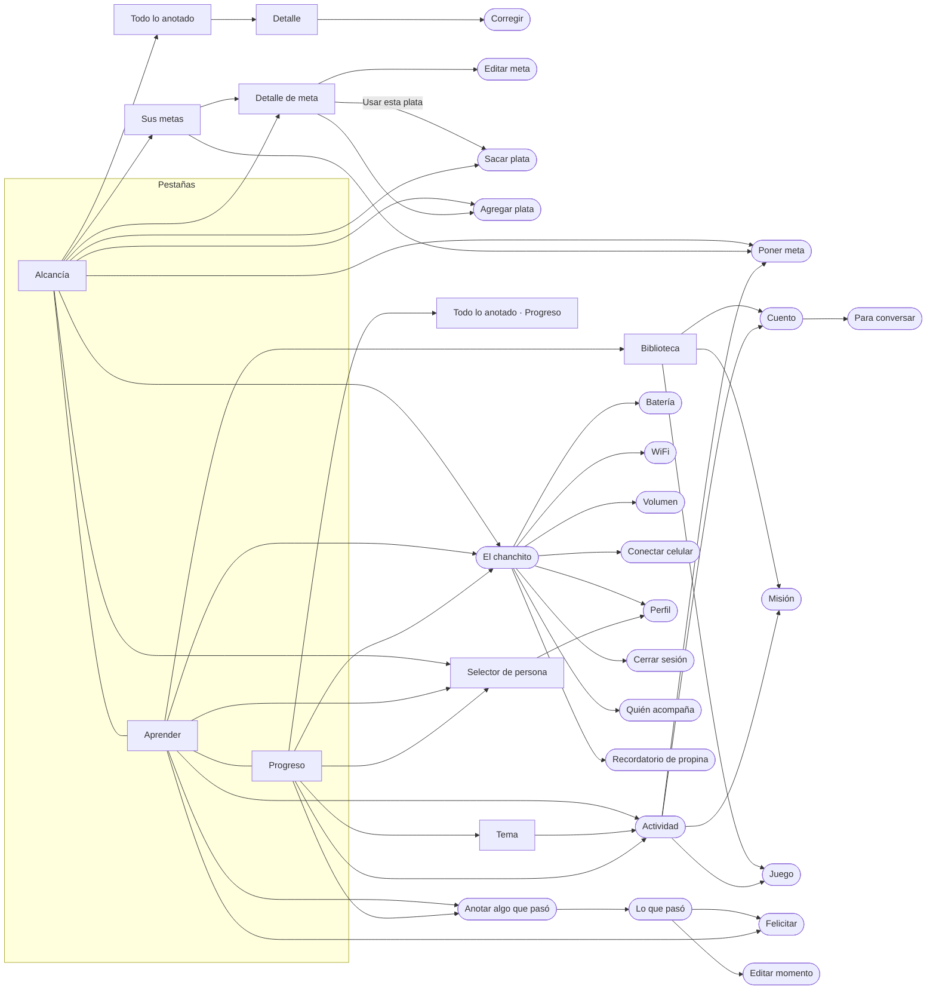
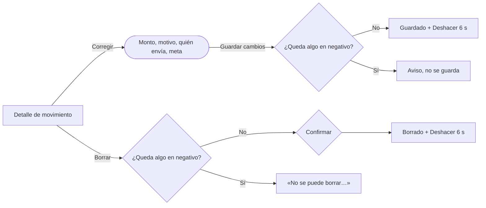
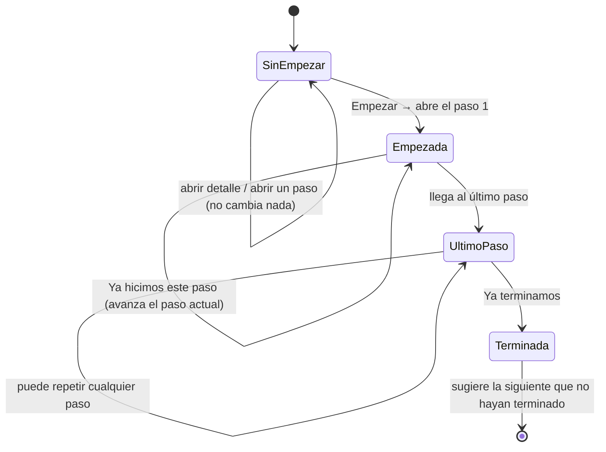
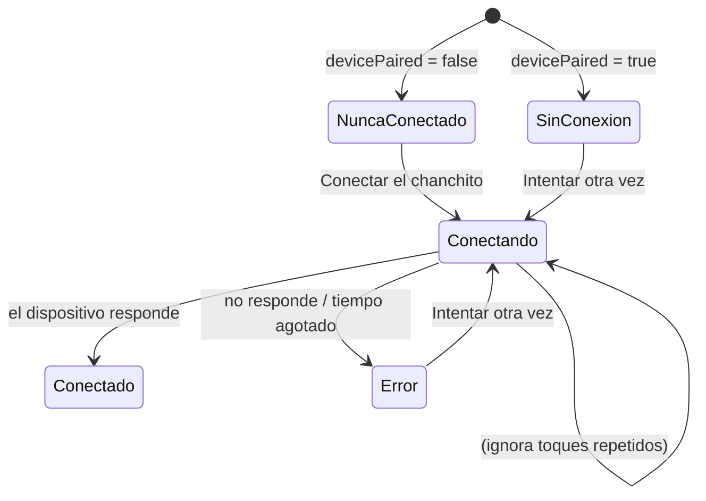

# Flujos

Los diagramas usan Mermaid (GitHub, GitLab, Notion y VS Code los muestran como gráfico).

## Mapa de navegación

`[ ]` = pantalla con barra inferior · `([ ])` = tarea enfocada, sin barra inferior.

## Agregar plata / Sacar plata

**Agregar plata (4 pasos):** Cuánto → ¿De dónde salió? (motivo + meta) → **¿Quién le envía?** (+ resumen y «Sí, anotar») → ¡Listo!
**Sacar plata (3 pasos):** Cuánto → ¿En qué la va a usar? (motivo + meta de origen + resumen y «Sí, anotar») → ¡Listo!

```mermaid
stateDiagram-v2
  [*] --> Cuanto: Agregar plata / Sacar plata / Agregar a esta meta / Usar esta plata
  Cuanto --> Cuanto: monto inválido (error junto al campo, Continuar deshabilitado)
  Cuanto --> DeDonde: Continuar (monto válido)
  Cuanto --> [*]: ✕ (confirma si ya eligió algo)
  DeDonde --> Cuanto: ← (conserva el borrador)
  DeDonde --> Quien: Continuar · solo agregar
  DeDonde --> Listo: Sí, anotar · solo sacar
  Quien --> DeDonde: ←
  Quien --> Listo: Sí, anotar (un solo envío; «Otro pariente» exige nombre)
  Listo --> [*]: Volver a Alcancía (sin poder volver atrás)
```

- **Lo que se recuerda:** al empezar, motivo, meta (si sigue disponible) y quién envía vienen de la última vez (`last`). Sin historial, «quién envía» es la relación de quien acompaña. Todo se puede cambiar.
- **Borrador:** si salen sin anotar, el borrador queda `active` y Alcancía muestra «Dejaron a medias: S/ X · Seguir / Descartar». Volver a abrir el mismo flujo lo retoma en vez de reiniciarlo.
- El **saldo cambia solo al confirmar**. Antes, «Así quedaría» es una proyección.
- Sacar plata no permite más que lo ahorrado ni más que lo que tiene la meta de origen («No le alcanza…», «Para «Meta» solo tiene…»).
- Si la persona vuelve al paso 1 con un monto que ya no es válido, los pasos siguientes regresan solos al paso 1.
- **¡Listo!** (agregar): moneda opcional para que el niño la «meta» al chanchito; si el motivo fue «Su propina de la semana» y no hay recordatorio, ofrece «¿Te recordamos los {día}…?».

## Corregir y borrar

- Igual para metas (borrar no borra plata: los movimientos quedan sin meta y conservan su nombre) y momentos (borrar quita también sus mensajitos).
- «Deshacer» restaura el estado completo de antes.

## Actividad

- Empezar marca el tema como «Ya empezaron» y lo deja como actividad «EN CURSO» en Aprender.
- «Ya terminamos» la saca de «en curso», la agrega a `finishedTopics` y celebra **sin puntaje**. Aprender propone la siguiente.
- Cada paso muestra su duración aproximada («5 min»).

## Anotar y felicitar

## Chanchito

- **Nunca conectado** (cuenta nueva): no se dice «Sin conexión»; se invita a «Conectar chanchito». No es un error.
- Nunca anunciar «Conectado» sin respuesta del dispositivo. Batería, WiFi y volumen muestran el último dato conocido y lo dicen.
- Un ajuste (WiFi, volumen) queda «pendiente» hasta que el chanchito confirme.
