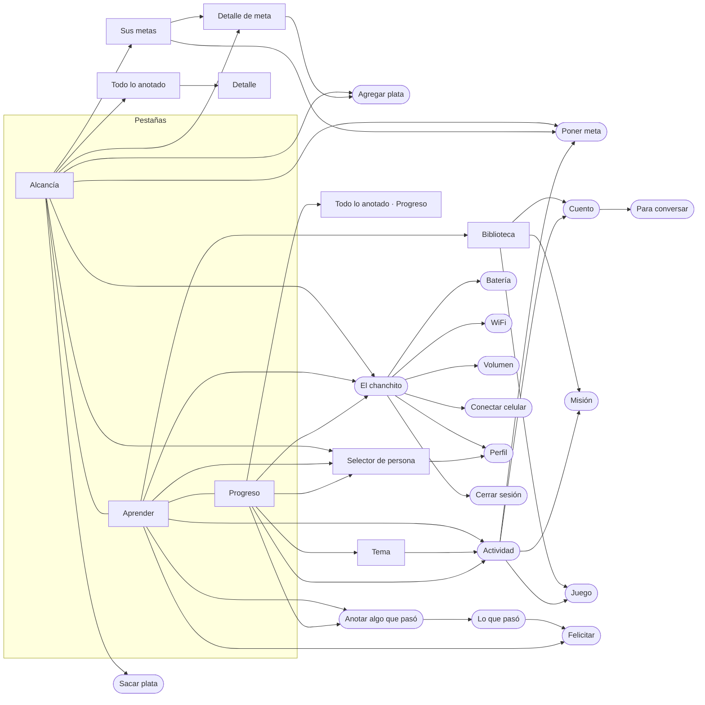
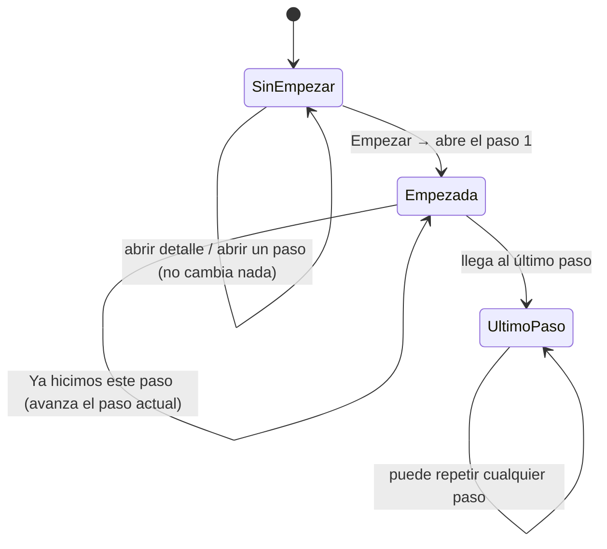
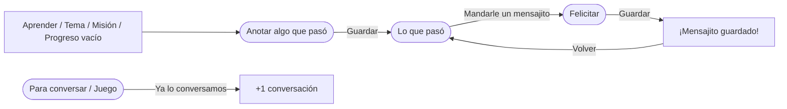
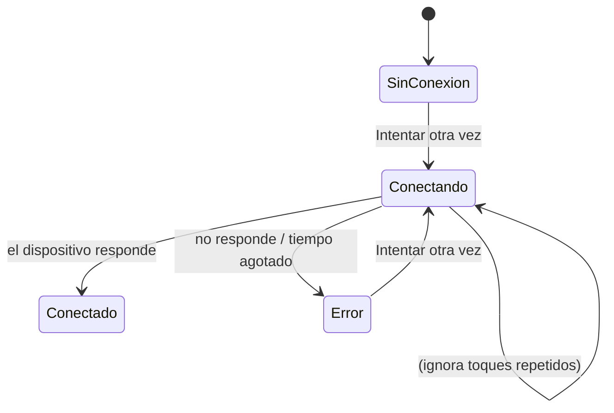

# Flujos

Los diagramas usan Mermaid (GitHub, GitLab, Notion y VS Code los muestran como gráfico).

## Mapa de navegación

`[ ]` = pantalla con barra inferior · `([ ])` = tarea enfocada, sin barra inferior.

## Agregar plata / Sacar plata

```mermaid
stateDiagram-v2
  [*] --> Cuanto: Agregar plata / Sacar plata / Agregar a esta meta
  Cuanto --> Cuanto: monto inválido (error junto al campo, Continuar deshabilitado)
  Cuanto --> DeDonde: Continuar (monto válido)
  Cuanto --> [*]: ✕ (confirma si ya eligió algo)
  DeDonde --> Cuanto: ← (conserva el borrador)
  DeDonde --> Revisar: Continuar (opción elegida; «Otra cosa» con texto)
  Revisar --> DeDonde: ←
  Revisar --> Listo: Sí, anotar (un solo envío)
  Listo --> [*]: Volver a Alcancía (sin poder volver atrás)
```

- El **saldo cambia solo al confirmar** en «¿Todo bien?». Antes, «Así quedaría» es una proyección.
- Sacar plata valida en el paso 1 y vuelve a validar en el 2/3: no más que lo ahorrado ni más que lo que tiene la meta de origen («No le alcanza…», «Para «Meta» solo tiene…»).
- Si la persona vuelve al paso 1 con un monto que ya no es válido, los pasos 2 y 3 regresan solos al paso 1.

## Actividad

- Empezar marca el tema como «Ya empezaron» y lo deja como actividad «EN CURSO» en Aprender.
- No hay «terminada» ni puntaje: el último paso solo invita a ver otro tema.

## Anotar y felicitar

## Chanchito

- Nunca anunciar «Conectado» sin respuesta del dispositivo. Batería, WiFi y volumen muestran el último dato conocido y lo dicen.
- Un ajuste (WiFi, volumen) queda «pendiente» hasta que el chanchito confirme.
